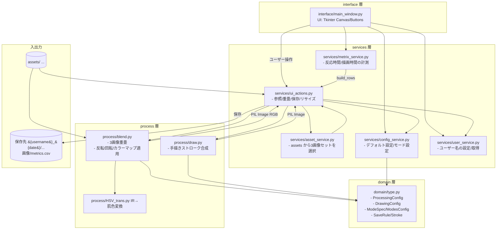

# アーキテクチャ図（Mermaid）

```mermaid
flowchart TB
	%% レイヤーのサブグラフ
	subgraph Interface[interface 層]
		MW[interface/main_window.py\nUI: Tkinter Canvas/Buttons]
	end

	subgraph Services[services 層]
		UIA[services/ui_actions.py\n- 参照/重畳/保存/リサイズ]
		MET[services/metrix_service.py\n- 反応時間/描画時間の計測]
		ASSET[services/asset_service.py\n- assets から3画像セットを選択]
		CONF[services/config_service.py\n- デフォルト設定/モード設定]
		USER[services/user_service.py\n- ユーザー名の設定/取得]
	end

	subgraph Process[process 層]
		BLEND[process/blend.py\n- 3画像重畳\n- 反転/回転/カラーマップ適用]
		DRAW[process/draw.py\n- 手描きストローク合成]
		HSV[process/HSV_trans.py IR→肌色変換]
	end

	subgraph Domain[domain 層]
		TYPES[domain/type.py\n- ProcessingConfig\n- DrawingConfig\n- ModeSpec/ModesConfig\n- SaveRule/Stroke]
	end

	subgraph IO[入出力]
		ASSETS[(assets/ ...)]
		OUTDIR[(保存先 &#123;username&#125;_&#123;date&#125;/...\n画像/metrics.csv)]
	end

	%% 依存とデータフロー
	MW -->|ユーザー操作| UIA
	MW --> MET
	MW --> USER
	MW --> CONF

	UIA --> BLEND
	UIA --> DRAW
	UIA --> USER
	UIA --> CONF
	UIA -->|保存| OUTDIR

	MET -->|build_rows| UIA

	BLEND --> HSV
	BLEND --> TYPES
	DRAW --> TYPES

	ASSET --> UIA
	UIA --> ASSET

	CONF --> TYPES

	ASSETS --> BLEND
	ASSETS --> UIA
	BLEND -->|PIL Image RGB| UIA
	DRAW -->|PIL Image| UIA
```

補足:
- 依存の方向は Interface → Services → Process/Domain（内向き）。
- Services は入出力（ファイル保存、assets探索）をオーケストレートし、Process に画像処理を委譲します。
- Domain は型と設定の定義のみを担い、実装は持ちません。